# 🛍️ **E-Commerce Application**

**[Live Demo](https://e-commerce-app-three-eta.vercel.app/)**

**E-Commerce Application** is a fully functional, feature-rich online shopping platform built with **React** and **Tailwind CSS**. It offers a seamless shopping experience with advanced filtering, real-time search, and dynamic cart functionality. Whether you're browsing for Men, Women, or Kids' fashion, this app ensures a smooth and responsive experience across all devices.

---

## 🔥 **Key Features**

- **Product Sorting**: Sort products by relevance, price (low to high, high to low) for easy navigation.
- **Advanced Filtering**: Filter by categories (Men, Women, Kids) and sub-categories (Top Wear, Bottom Wear, Winter Wear).
- **Real-Time Search**: Instantly find products with a fast and responsive search bar.
- **Fully Responsive Design**: Optimized for mobile, tablet, and desktop.
- **Add to Cart**: Select sizes before adding items, with toast notifications for size selection reminders.
- **Cart Notifications**: Interactive toast notifications for adding/removing items.
- **Real-Time Cart Calculation**: Dynamic updates to cart totals for instant feedback.

---

## 🖼️ **Screenshots**

### Home Page

  
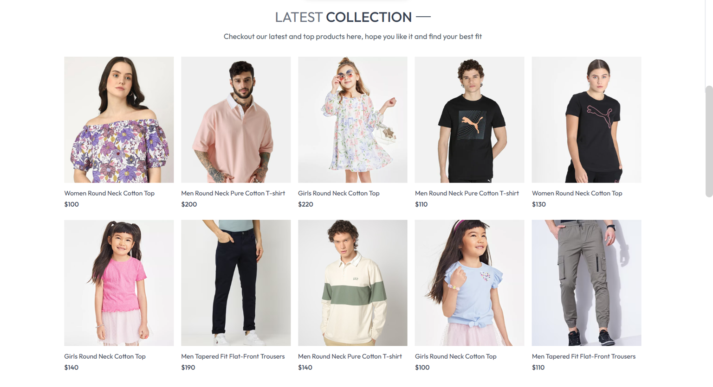  
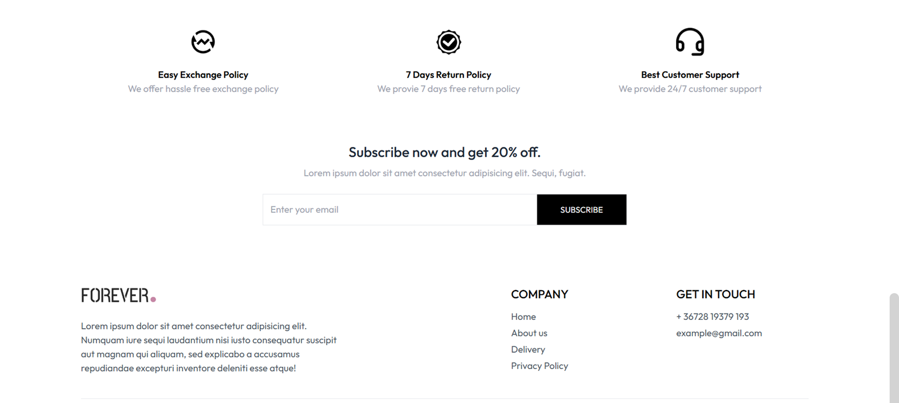  
_The homepage showcases featured products and categories for easy navigation._

### Collection Page

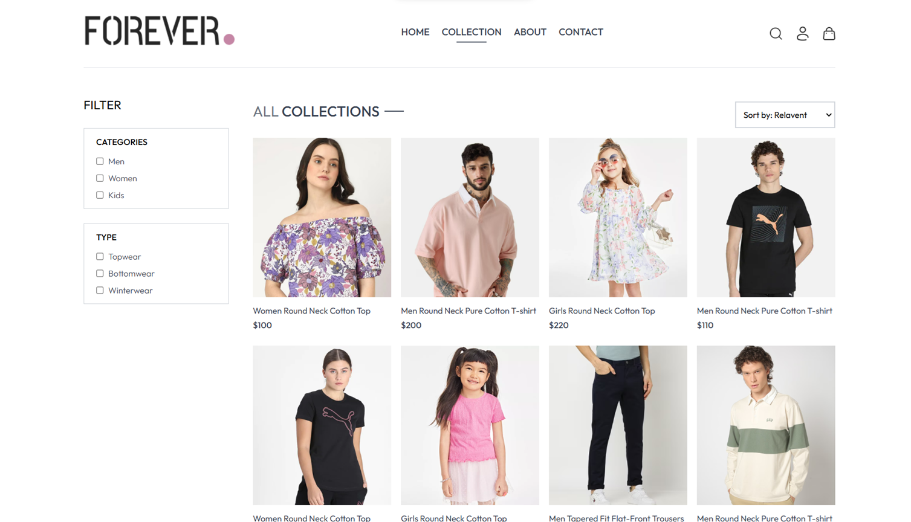  
_Browse products by category with advanced filtering and sorting options._

### About Page

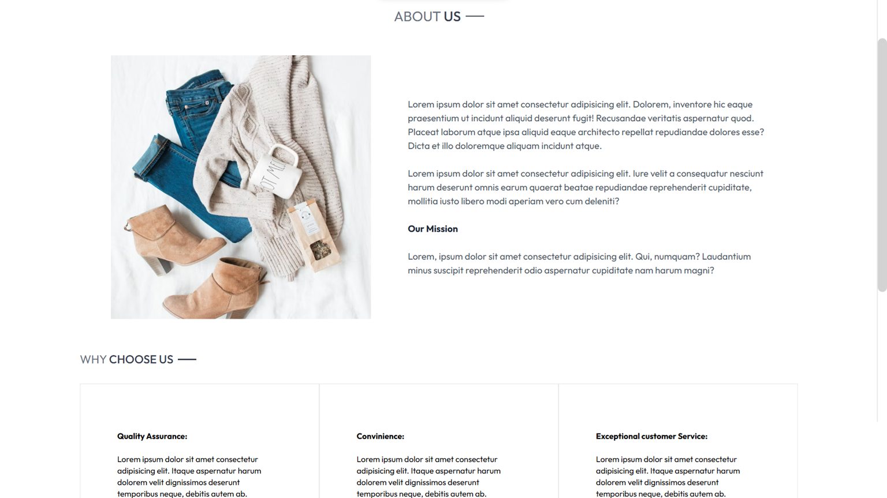  
_Learn more about the brand and its mission._

### Contact Page

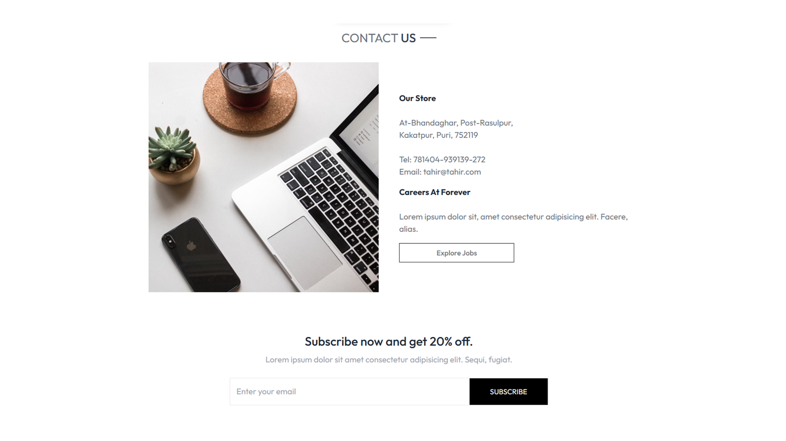  
_Get in touch with the team for inquiries or support._

### Product Page

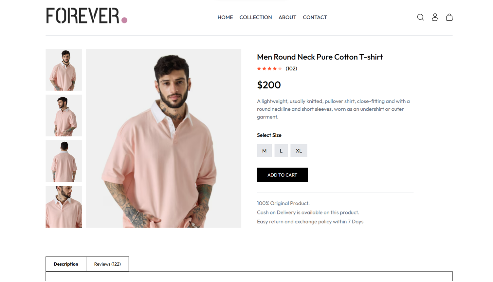  
_View detailed product information, including sizes, descriptions, and pricing._

### Your Cart

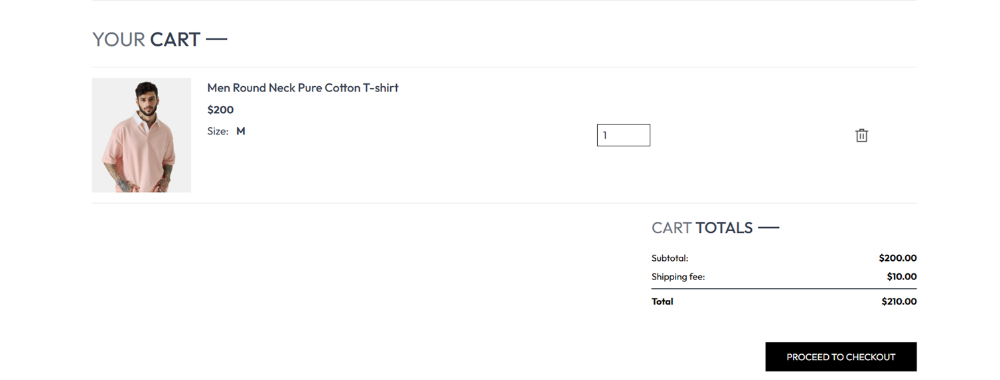  
_Manage your shopping cart with real-time price updates._

### Checkout

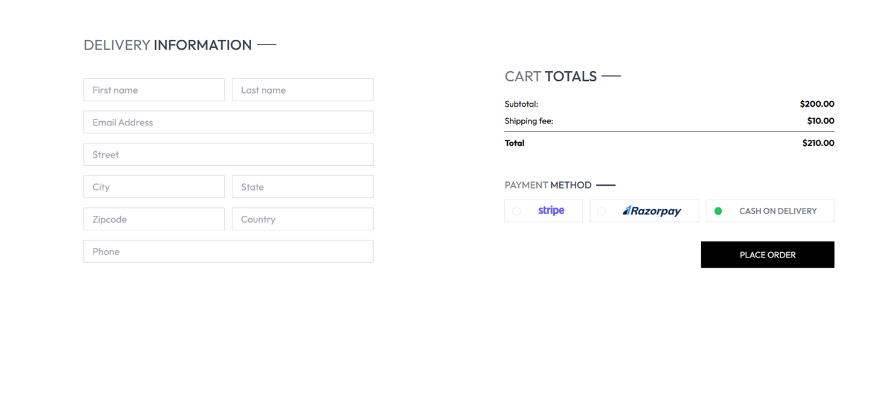  
_Securely complete your purchase with a streamlined checkout process._

### Place Order

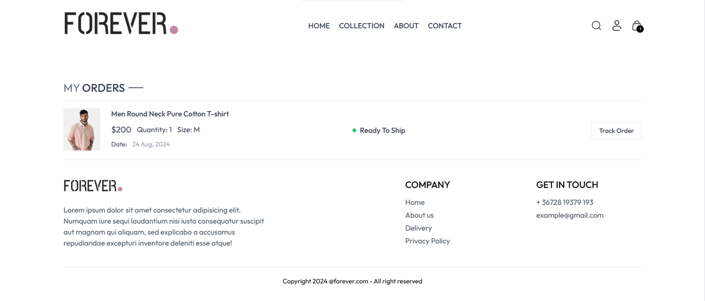  
_Confirmation page after successfully placing an order._

---

## 📱 **Responsive Design (Mobile UI)**

The application is fully optimized for mobile devices, ensuring a seamless shopping experience on smaller screens. Here are some screenshots of the mobile UI:

| **Home Page**                                                                       | **Navigation**                                                                           | **Product Page**                                                                      |
| ----------------------------------------------------------------------------------- | ---------------------------------------------------------------------------------------- | ------------------------------------------------------------------------------------- |
| 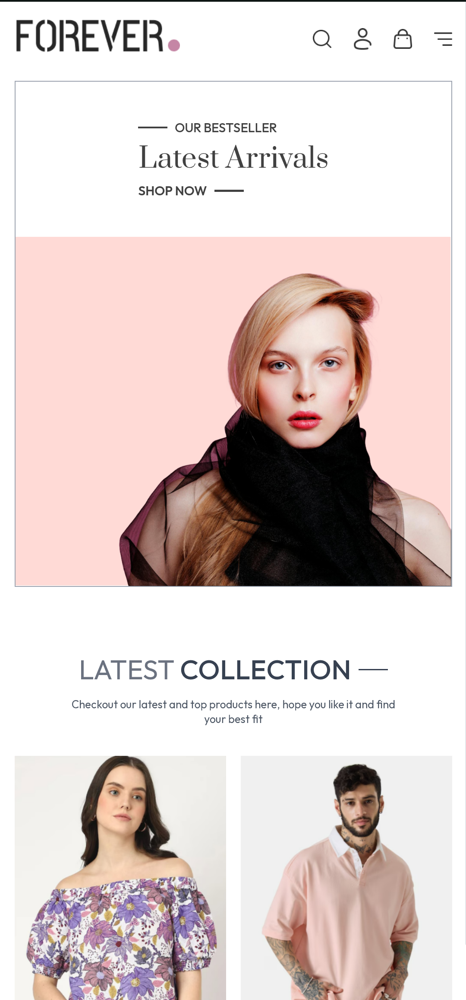 | 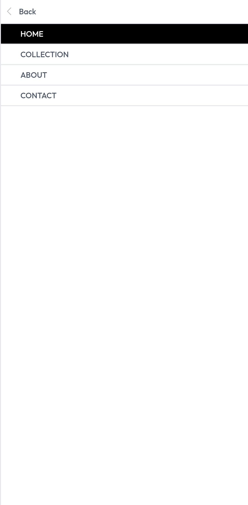 | 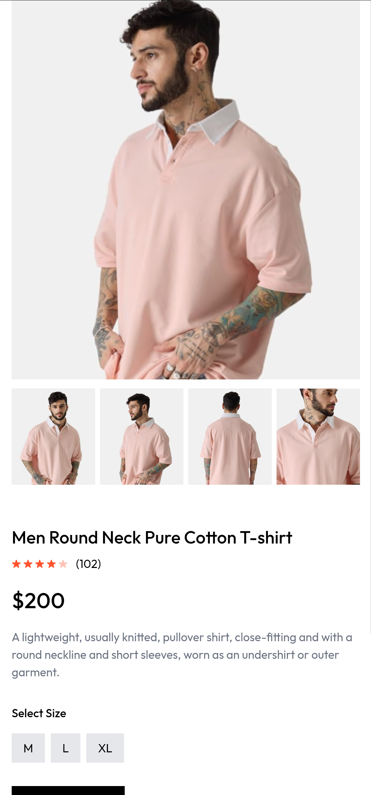 |

| **Collection**                                                                | **Sign In**                                                                       |
| ----------------------------------------------------------------------------- | --------------------------------------------------------------------------------- |
| 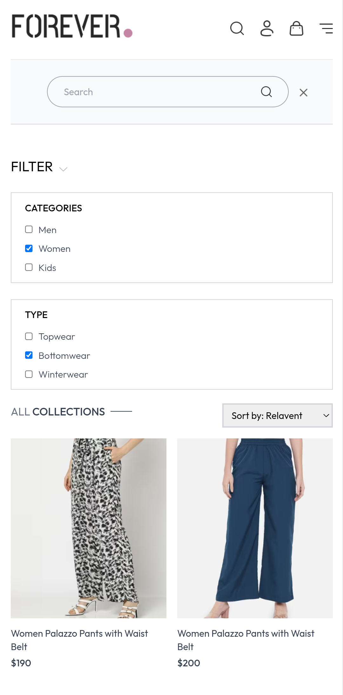 | 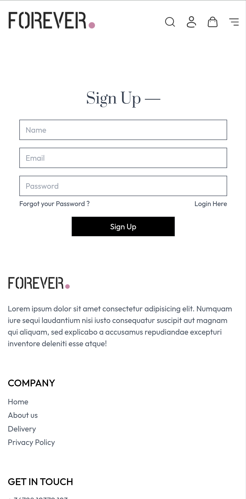 |

---

## 🎥 **Video Walkthrough**

Watch the full demo on LinkedIn to see the project in action:  

---

## 🛠️ **Built With**

- **Frontend**: React, Tailwind CSS
- **State Management**: React Context API
- **Routing**: React Router
- **Responsive Design**: Tailwind CSS (Flexbox, Grid)
- **Deployment**: Vercel
